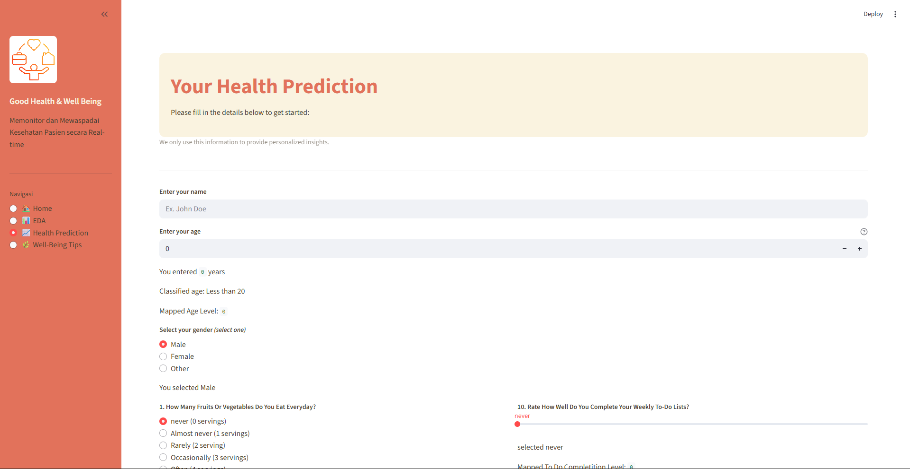

# Work Life Balance with Stacking Model

<table>
  <tr>
    <td align="center" width="100%">
      <!-- Ganti link gambar di bawah ini dengan plot hero kamu -->
      
    </td>
  </tr>
</table>

Work–life balance is a commonly discussed concept that reflects how individuals manage their time, energy, and responsibilities between work and personal life. In this project, my contribution (Defa Danuarta) focused on data preparation, including feature selection, identifying correlated variables, and cleaning the dataset from inconsistencies and errors.

The core idea behind this project comes from the observation that many people work extremely hard to meet their needs, often without realizing where they currently stand in terms of balance. By building this model using Stacking Model, the goal is to provide insights that can help individuals better understand their work–life balance condition and possibly improve it through data-driven awareness.

## Dataset
We used a clean dataset founded on kaggle, titled: "Lifestyle_and_Wellbeing_Data". This data coverage all of the process especially in training
[Click here to see the dataset](https://www.kaggle.com/datasets/ydalat/lifestyle-and-wellbeing-data)

## Publisher
Defa Danuarta (Data Analyst & Computer Science Student)
<br>

## Team Credit
Shout out to these people behind the idea
1. Eduard Mario Kayesa
2. I Kadek Defa Danuarta
3. Faradilla Alfaira Chandra
4. Gabriela Sarifa Cristiananda

## Built Time
This project was developed during the time of our 4th Semester as a team.  
<br>

## Project Title Update 🙏
The project title has been updated from _“Work Life Balance with XGBoost”_ to _“Work Life Balance with Stacking Model.”_
The previous title reflected the initial experimentation phase, where XGBoost was one of the primary models tested. After comparing multiple algorithms and evaluating performance, the Stacking Regressor was selected as the final model for deployment due to its superior and more stable results.

## Libraries Used

This project was built using the following Python libraries:

```python
# Core Library
import pandas as pd
import numpy as np
import datetime, random

# Visualization
import matplotlib.pyplot as plt
import seaborn as sns

# Preprocessing
from sklearn.preprocessing import LabelEncoder
from sklearn.preprocessing import MinMaxScaler
from sklearn.preprocessing import StandardScaler
from sklearn.preprocessing import PowerTransformer

# Modelling
from sklearn.linear_model import LinearRegression
from sklearn.model_selection import train_test_split

# Evaluation
from sklearn.metrics import mean_squared_error, mean_absolute_error, r2_score

# Dashboard
import streamlit as st

# Load Model
import joblib
```

## Guide to run the code
---
This is the step by step to run the code:
1. Make sure you had the dependencies, if you haven't installed yet, follow this command
```bash
pip install streamlit pandas numpy scikit-learn matplotlib seaborn joblib
```
2. After install, go to project directory
```bash
cd path/to/your/project-directory
```
3. Run the app
```bash
streamlit run Home.py
```

## Key Metrics
---
Based on the project, the model it self have a metrics that we aim to be inspected, starting with:
1. MAE: Mean Average Error
2. MSE: Mean Squared Error
3. R² Score: r2 score


---

## Files description
```
Work-Life-Balance-Stacking-Model/
│── Home.py                                 # Main Streamlit entry point
│── style.css                               # Custom UI styling
│── datasets_wellbeing.csv                  # Cleaned dataset used for modeling
│── linear_regression.pkl                   # Saved Linear Regression model
│── stacking_model.pkl                      # Final stacked model
│── scaler.pkl                              # MinMaxScaler / StandardScaler object
│── power_transfromer.pkl                   # PowerTransformer object
│── profil.png / profil.webp                # Display images for the UI
│── worklife.png                            # Visual asset used in the app
│── work_life_balance_with_baseModel.ipynb  # Notebook for experimentation
│
└── pages/                                  # Streamlit pages folder
    └── __pycache__/                        # Auto-generated cache
    └── thumbnail/                          # Used images / output exports
```
